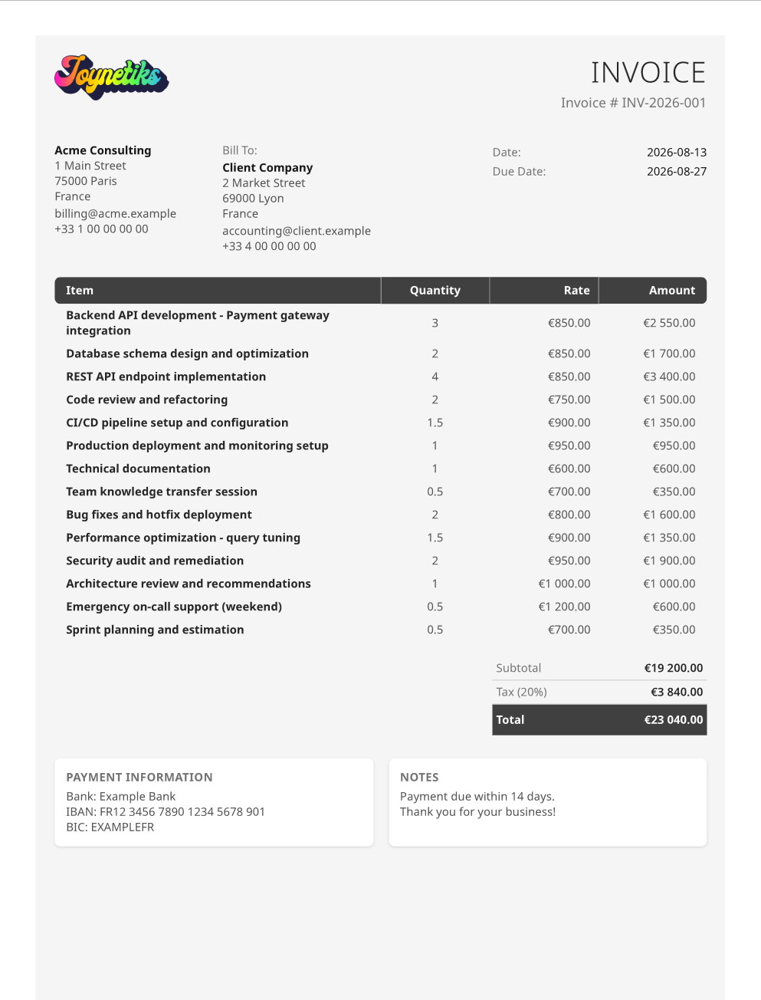

# ymlbill

A CLI tool to generate PDF invoices and quotes from YAML files.

## Example Output



## Why ymlbill?

ymlbill was built with version control and filesystem-based organization in mind. Instead of storing invoices in a proprietary database or SaaS platform, everything lives as plain YAML files in your project directory:

- **Versionable**: Track every invoice change with git.
- **Filesystem-native**: Organize clients, sellers, and invoices in a logical folder structure
- **Template-driven**: One template, infinite variations. Can be customized per client or project

### Example folder structure

```
your-project/
├── sellers/
│   └── acme.yml
├── clients/
│   ├── client_a/
│   │   ├── client.yml
│   │   ├── invoice_001.yml <-- Refer to client.yml
│   │   ├── invoice_002.yml
│   │   └── quote_2026_001.yml
│   └── client_b/
│   │   ├── client.yml
│       └── invoice_001.yml
└── invoices/
    └── 2026/
        └── INV-2026-001.pdf
```

Reference sellers and clients from any invoice:

```yaml
# invoices/2026/INV-2026-001.yml
document:
  type: invoice
  number: INV-2026-001

seller: ../sellers/acme.yml
client: ../clients/client_a/client.yml # or inline
```

## Installation

### With Nix (no installation required)

Run directly without installing:

```bash
nix run github:pcboy/ymlbill -- generate invoice.yml
```

### With Ruby

```bash
gem install ymlbill
```

### From source

```bash
git clone https://github.com/pcboy/ymlbill
cd ymlbill
gem build ymlbill.gemspec
gem install ./ymlbill-*.gem
```

## Quick Start

1. Create an invoice YAML file:

```yaml
# invoice.yml
document:
  type: invoice
  number: INV-2026-001
  date: 2026-08-13
  due_date: 2026-08-27
  currency: EUR
  tax_perc: 20

seller: sellers/acme.yml
client: clients/client_1.yml

items:
  - description: Consulting services
    quantity: 3
    unit_price: 150.00
```

2. Generate the PDF:

```bash
ymlbill generate invoice.yml
```

### Custom template

```bash
ymlbill generate invoice.yml -t custom.html.erb
```

### Custom output path

```bash
ymlbill generate invoice.yml -o output.pdf
```

### Options

- `-t, --template PATH` - Custom HTML ERB template
- `-o, --output PATH` - Output PDF path
- `--version` - Print version
- `-h, --help` - Show help

## Example YAML

### Inline client and seller

```yaml
# invoice.yml
document:
  type: invoice
  number: INV-2026-001
  date: 2026-08-13
  due_date: 2026-08-27
  currency: EUR
  tax_perc: 20

seller:
  name: Acme Corp
  email: billing@acme.com
  phone: +33 1 23 45 67 89
  address: |
    123 Business St
    75001 Paris
    France

client:
  name: Client Corp
  email: contact@client.com
  address: |
    456 Client Ave
    69001 Lyon
    France

items:
  - description: Consulting services
    quantity: 3
    unit_price: 150.00
  - description: Travel expenses
    quantity: 1
    unit_price: 50.00
```

### With file references

```yaml
# invoice.yml
document:
  type: invoice
  number: INV-2026-001
  date: 2026-08-13
  currency: EUR
  tax_perc: 20

seller: sellers/acme.yml
client: clients/client_1.yml

items:
  - description: Web development
    quantity: 10
    unit_price: 120.00
```

### Quote example

```yaml
# quote.yml
document:
  type: quote
  number: QUO-2026-001
  date: 2026-08-13
  currency: EUR
  tax_perc: 20

seller:
  name: Acme Corp
  email: billing@acme.com
  address: |
    123 Business St
    75001 Paris
    France

client:
  name: Prospect Ltd
  email: contact@prospect.com
  address: |
    789 Prospect Blvd
    13001 Marseille
    France

items:
  - description: Website redesign
    quantity: 1
    unit_price: 2500.00
```

## Custom Templates

A default template is included at [`lib/ymlbill/templates/default.html.erb`](lib/ymlbill/templates/default.html.erb).

**Note:** With the bundled template, payment information only appears when `document.type` is set to `invoice` in the YAML file. Quotes will not display payment info.

Create a custom ERB template to customize the invoice/quote appearance:

```erb
<!-- custom.html.erb -->
<!DOCTYPE html>
<html>
<head>
  <meta charset="utf-8">
  <script src="https://cdn.jsdelivr.net/npm/@tailwindcss/browser@4"></script>
</head>
<body class="p-8">
  <h1 class="text-3xl font-bold mb-4"><%= data.document.type.capitalize %></h1>
  <p>Number: <%= data.document.number %></p>
  <p>Date: <%= data.document.date %></p>

  <div class="mt-8">
    <h2 class="text-xl font-semibold">Seller</h2>
    <p><%= data.seller.name %></p>
    <p><%= data.seller.address %></p>
  </div>

  <div class="mt-4">
    <h2 class="text-xl font-semibold">Client</h2>
    <p><%= data.client.name %></p>
  </div>

  <table class="mt-8 w-full">
    <thead>
      <tr>
        <th>Description</th>
        <th>Qty</th>
        <th>Unit Price</th>
        <th>Total</th>
      </tr>
    </thead>
    <tbody>
      <% data.items.each do |item| %>
      <tr>
        <td><%= item.description %></td>
        <td><%= item.quantity %></td>
        <td><%= money(item.unit_price, data.document.currency) %></td>
        <td><%= money(item.quantity * item.unit_price, data.document.currency) %></td>
      </tr>
      <% end %>
    </tbody>
  </table>
</body>
</html>
```

The template has access to:

- `data` - All YAML data with dot notation (e.g., `data.document.number`, `data.client.name`)
- `money(amount, currency)` - Helper to format currency using the Money gem. Currency must be a valid ISO 4217 code (e.g., EUR, USD, GBP)

Then use it with:

```bash
ymlbill generate invoice.yml -t custom.html.erb
```

## Flexibility: Add Any Fields You Need

The YAML structure is completely flexible. You can add any custom fields to your invoice and they will be passed through to your template:

```yaml
# invoice.yml
document:
  type: invoice
  number: INV-2026-001
  date: 2026-08-13
  currency: EUR
  tax_perc: 20

seller: sellers/acme.yml
client: clients/client_1.yml

# Custom fields - add whatever you need
project:
  name: Website Redesign
  code: PRJ-2026-042
  manager: John Doe

items:
  - description: Development
    quantity: 10
    unit_price: 150.00

# Add notes, terms, or any other metadata
terms: Payment due within 30 days
po_number: PO-12345
```

Then access them in your custom template:

```erb
<p>Project: <%= data.project.name %> (<%= data.project.code %>)</p>
<p>Project Manager: <%= data.project.manager %></p>
<p>PO Number: <%= data.po_number %></p>
<p>Terms: <%= data.terms %></p>
```

This lets you adapt invoices to your specific business needs. Purchase orders, project codes, cost centers, custom tax fields, or any other metadata your workflow requires.

## Development

### Prerequisites

- Ruby 3.4+
- Nix (optional, for reproducible environment)

### Setup

```bash
# With Nix
nix develop

# Without Nix
bundle install
```

### Running tests

```bash
bundle exec rspec
```

### Building the gem

```bash
gem build ymlbill.gemspec
gem install ./ymlbill-*.gem
```

## Contributing

1. Fork the repository
2. Create a feature branch (`git checkout -b feature/my-feature`)
3. Commit your changes (`git commit -am 'Add new feature'`)
4. Push to the branch (`git push origin feature/my-feature`)
5. Create a Pull Request

## License

MIT
